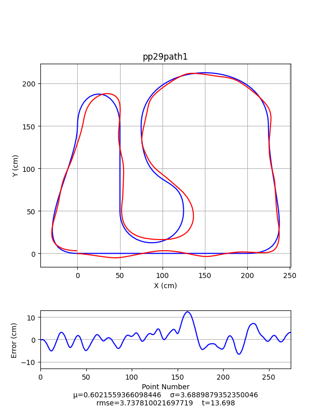

# Path Tracking
2020-2021 Capstone Project, exploring various path tracking algorithms and their efficacy when applied to a small autonomous robot of VEX Robotics parts.

### Abstract
Path tracking is a specific problem within the field of controls engineering that seeks to devise methods of following a path with an autonomous robot. There are many variations of path tracking that have been designed for different vehicles. This paper will give an overview of the process of path tracking and explore various algorithms used for path tracking, as well as some variations using adaptable parameters. Thereafter, the algorithms and their variations will be tested using a small skid-steer robotic vehicle constructed from VEX Robotics parts. Telemetry data from these tests is used to assess each algorithm's performance, and this data is analyzed to suggest future improvements.

# Navigating This Repository

### [code](./code)
The workspace for the code that runs on the robot. Written in C++ with the [PROS Kernel](https://github.com/purduesigbots/pros).

### [scripts](./scripts)
Contains the scripts for data processing that happens off of the robot, such as turning the data into images. Written in Python.

### [scripts/data](./scripts/data)
Contains the raw telemetry data from the robot in CSV files. Filenames refer to the algorithm and tuning paramters used, in the order they are listed in the constructors in the C++ code. Better documentation coming soon.

### [scripts/analysis](./scripts/analysis)
Contains the interpreted data in the form of images, with positional data plotted next to the reference path, as well as showing lateral deviation from the path over time. Stats files also exist, which show the statistics of each test together.
